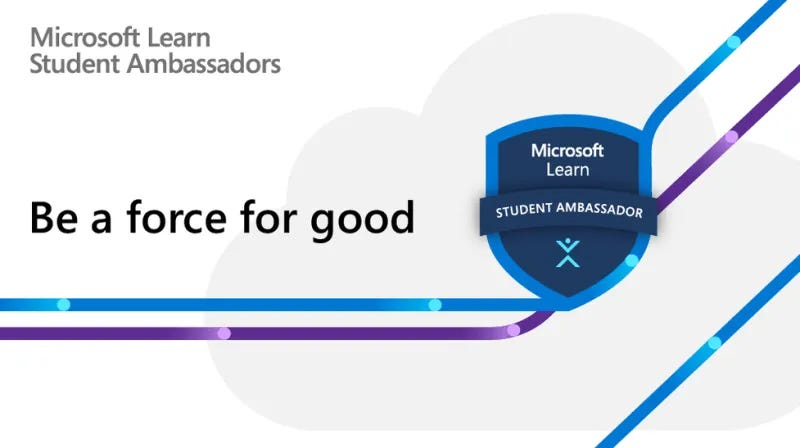

# MLSA Journey Documentation

Welcome to my documentation repository for the Microsoft Learn Student Ambassador (MLSA) program! This project aims to share my experiences, resources, and insights as I navigate through this journey. Whether you're a student or a tech enthusiast, I hope to inspire and assist you on your own path.

 

## Table of Contents

- [About Me](#about-me)
- [Goals](#goals)
- [MLSA Benefits](#mlsa-benefits)
- [Resources](#resources)
- [Events](#events)
- [Contact](#contact)

## About Me

I am a passionate student in the Faculty of Artificial Intelligence at Kafr El-Sheikh University. As a Microsoft Learn Student Ambassador, I strive to promote Microsoft technologies and empower my peers through knowledge sharing.

 

## Goals

- Document my journey and experiences in the MLSA program.
- Create impactful projects that showcase Microsoft technologies.
- Build a community of learners and enthusiasts.
- Share insights and lessons learned along the way.
- Achieve MVP (Most Valuable Professional) status by contributing to the tech community.

 <!-- Replace with actual image link -->

## MLSA Benefits

As a Microsoft Learn Student Ambassador, I have the opportunity to enjoy numerous benefits, including:

- **Access to Resources**: Gain access to exclusive Microsoft learning resources and tools.
- **Networking Opportunities**: Connect with industry professionals, other ambassadors, and tech enthusiasts from around the world.
- **Skill Development**: Enhance technical and leadership skills through various training sessions and workshops.
- **Recognition**: Receive acknowledgment for contributions to the tech community and the opportunity to be recognized as an MVP.
- **Community Impact**: Engage in community projects and initiatives that promote technology and education.

 <!-- Replace with actual image link -->

## Resources

This section includes links to valuable resources:

- [Microsoft Learn](https://learn.microsoft.com/?wt.mc_id=studentamb_352316)
- [MLSA Program](https://studentambassadors.microsoft.com/?wt.mc_id=studentamb_352316)
- [My YouTube Channel and Events](https://www.youtube.com/@mo7amed3twan)

## Events

In this section, I will document events related to Microsoft technologies that I participate in:

- **Event Title**: Description, date, and location.
- **Event Title**: Description, date, and location.
- **Event Title**: Description, date, and location.

 <!-- Replace with actual image link -->

## Contact

Feel free to reach out for collaboration, questions, or discussions:

- **Email**: [Mohamed.Atwan@studentambassadors.com](mailto:Mohamed.Atwan@studentambassadors.com)
- **LinkedIn**: [Your LinkedIn Profile](https://www.linkedin.com/in/Mo7amed3twan)

 